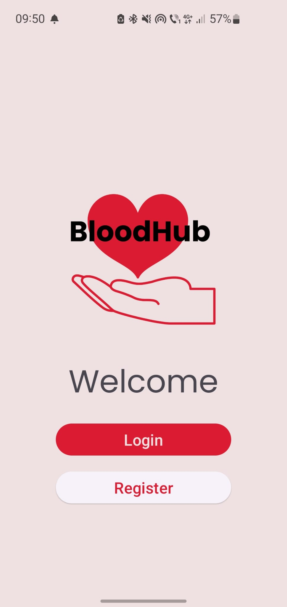

# BloodHub - Mobile Blood Donation Appointment App

  

## Overview

BloodHub is a mobile application designed to facilitate blood donation appointments for users. The app allows users to register, login, view donation centers, and make appointments to donate blood.

## Features

- **Authentication**: Users can register and login securely using Firebase Authentication.
- **Profile Page**: Users have access to a personalized profile page where they can view and manage their account information.
- **Donation Centers**: Users can browse a list of donation centers in the country and view them on a map using Google Maps SDK for Kotlin.
- **Appointment Booking**: Users can schedule appointments to donate blood at their preferred donation center.
- **Local Database**: User data is stored locally using Firebase Firestore, providing offline access and improved performance.
- **Data Persistence**: User preferences are stored using SharedPreferences, ensuring a seamless experience across app sessions.
- **HTTP Requests**: The app makes HTTP requests to retrieve data, such as donation center information, from remote servers.
- **Shape Drawables**: Custom shape drawables, color selectors, and gradients are used to enhance the visual appeal of the app.

## Development Details

- **Technology Stack**: Android, Kotlin, Firebase Authentication, Firebase Firestore, SharedPreferences, Google Maps SDK for Kotlin.
- **Architecture**: The app follows the MVVM (Model-View-ViewModel) design pattern for clean and organized code.
- **Version Control**: The project is hosted on GitHub for collaborative development and version control.
- **Development Progress**: The project is currently under development, with ongoing work to implement additional features and improve functionality.

## Getting Started

To run the BloodHub app on your local machine, follow these steps:

1. Clone the repository to your local machine using Git:

`git clone https://github.com/ccaesar26/BloodHub.git`

2. Open the project in Android Studio.

3. Configure Firebase Authentication and Firestore for your project by following the Firebase setup instructions.

4. Ensure that you have the necessary dependencies installed and configured in your Android project.

5. Run the app on an emulator or physical device to test its functionality.

## Contributing

Contributions to BloodHub are welcome! If you'd like to contribute to the project, please follow these guidelines:

- Fork the repository and create a new branch for your feature or bug fix.
- Make your changes and test them thoroughly.
- Submit a pull request with a clear description of your changes and their purpose.

## License

This project is not licensed and comes with no warranty or guarantee of any kind. You are free to view and fork the code for personal and educational purposes.

## Team Members

- **Cezar Constandoiu**: [ccaesar26](https://github.com/ccaesar26)
- **Ivana Florin-Andrei**: [florin-irl](https://github.com/florin-irl)
